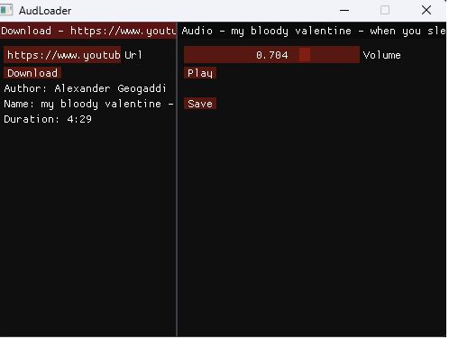

# AudLoad
A tool to download and play audio from supported sources

## Third-Party Libraries

This project uses Dear ImGui (https://github.com/ocornut/imgui), licensed under the MIT License.

This program uses FFmpeg (https://ffmpeg.org), licensed under LGPL/GPL. FFmpeg is used for audio format conversion only (see `build/bin/ffmpeg/` for license).

This project uses miniaudio (https://github.com/mackron/miniaudio), licensed under public domain / MIT license.

This project uses json (https://github.com/nlohmann/json), licensed under MIT license.

This project uses GLFW (https://www.glfw.org/), licensed under zlib/libpng, for window creation and input handling.

This project uses OpenGL for rendering graphics.